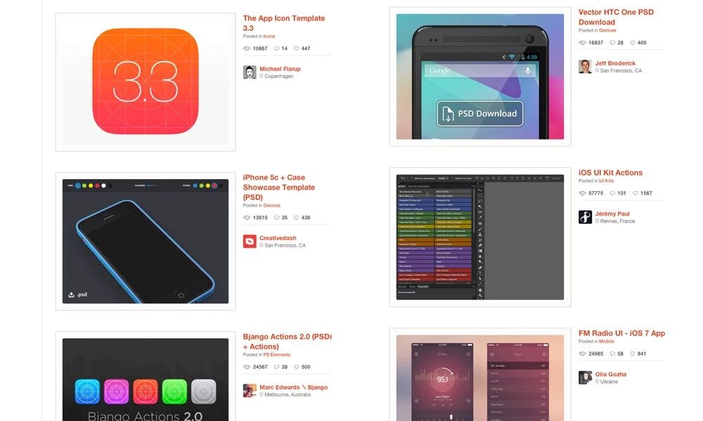
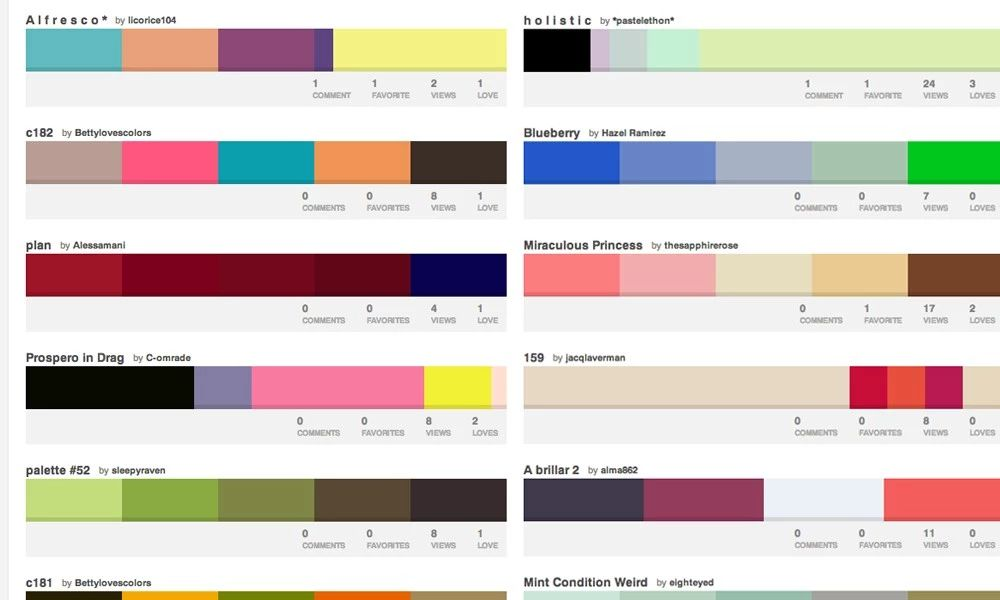
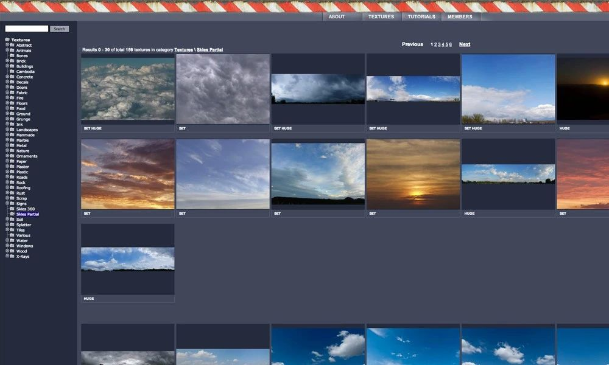
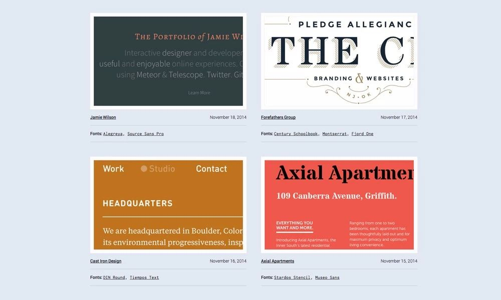
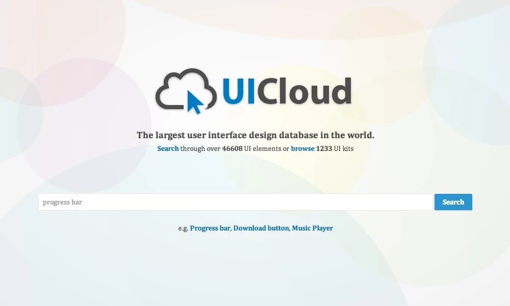

免费的资源网站，设计师的福利，仅限个人使用过的

<!-- more -->

### 1. psddd.co
https://psddd.co/

一个获取免费 PSD 文档的好网站，同时它也提供背景模版和UI 元件。

### 2. Colour lovers
http://www.colourlovers.com/

想获得完美的色彩组合吗？那么我会去这个网站。获得色彩灵感最最最最完美的方法。

### 3. CG textures
http://cgtextures.com/

一个可以下载相片的免费图库。内容从石头、天空到大自然，应有尽有。

### 4. Perfect Effects 3
http://www.ononesoftware.com/products/effects9free/

专为摄影师而设计!Perfect Effects 3 是一款直观又强大的工具，可以很容易地为照片加入效果，一些在Photoshop、Lightroom、Photoshop Elements 或Aperture 需要费时才能做出来的效果，在Perfect Effects 3 可以轻松办到。

### 5. Typewolf
https://www.typewolf.com/

Typewolf 能将各个网站使用的字体直接显示出来，并有针对类似字体提供建议。

### 6. UI Cloud
http://ui-cloud.com/

全世界最大的用户界面设计资料库，提供超过46,608 种UI 元件免费下载。

